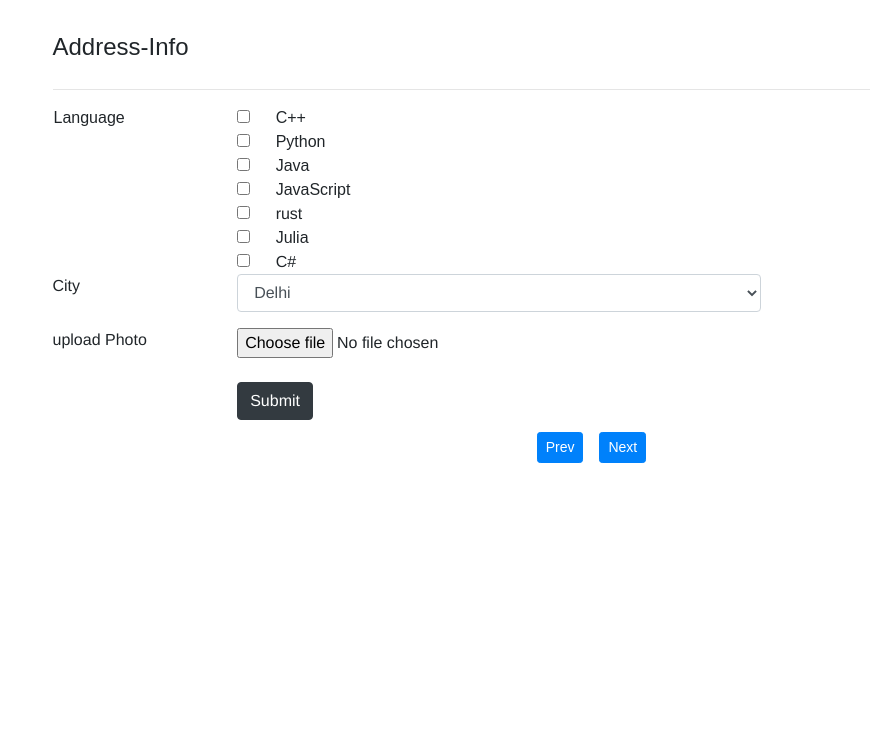
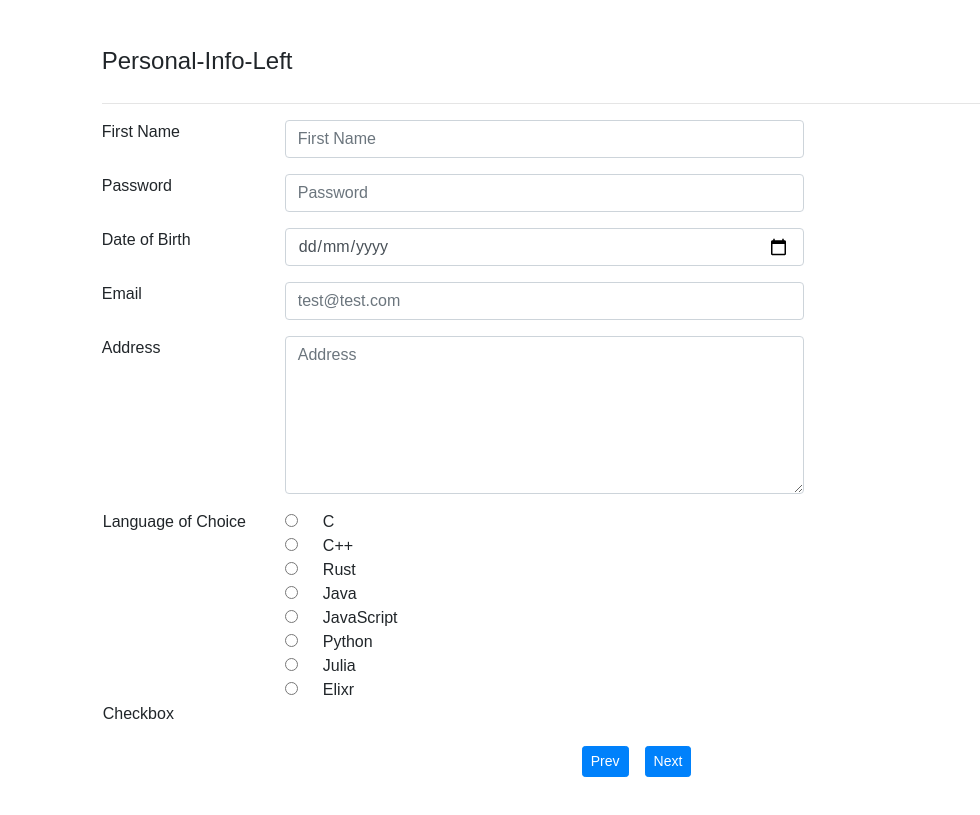

# forms.js
A simple light weighted javascript library built on top of bootstrap to dynamically generate responsive forms using json objects

# Status
This is a very basic version of what i am trying to do, currently working on this to make it more robust and useful.

# Example

it is very easy to use all you need is just to include `forms.js` in your `HTML document`

a sample `index.html` would look like

```HTML
<!DOCTYPE html>
<html>
  <head>
    <meta name="viewport" content="width=device-width, initial-scale=1, shrink-to-fit=no">
    <script src="./forms.js"></script>
    <script src="./main.js"></script>
  </head>
  <title>Test Page</title>
  <body>
    <div class="container">
      <h1>Test Text</h1>
    </div>
    <form id="form-1">
    <!-- within this tag the dynamically generated forms are plugged -->
    </form>
  </body>
</html>
```

in order to trigger the inbuilt library functions you would need a seprate javascript file that is `main.js` in this case

let's look over the sample `main.js`
```javascript
var details = {
  "configuration": {
    'form-width': '8',
    'd-left': '3',
  },
  "Personal-Info-Left": {
    1: {
      'tagName': 'input', 
      'label': 'First Name',
      'labelPosition': 'left',
      'tooltip' : "Type your full name",
      'attributes': {
        'type': 'text',
        'placeholder': 'First Name',
        'class': 'form-group form-control',
        'id': 'name' 
      },
    },
    2: {
      'tagName': 'input',
      'label': 'Password',
      'labelPosition': 'left',
      'tooltip' : `password must contain
      more than 8 characters
      including symbols like @,#,* etc
      including numbers 1,2,3,4 etc
      and alphabets a,b,c,d,A,B,D etc.
      `,
      'attributes':
      {
        'type': 'password',
        'placeholder': 'Password',
        'class': 'form-group form-control',
      },
    },
    3: {
      'tagName': 'input',
      'label': 'Date of Birth',
      'labelPosition': 'left',
      'tooltip' : 'type date of birth in DD/MM/YY',
      'attributes':
      {
        'type': 'date',
        'placeholder': 'Date Of Birth',
        'class': 'form-group form-control',
      }
    },
    4: {
      'tagName': 'input',
      'label': 'Email',
      'labelPosition': 'left',
      'attributes':
      {
        'type': 'email',
        'placeholder': 'test@test.com',
        'class': 'form-group form-control',
      }
    },
    5: {
      'tagName': 'textarea',
      'label': 'Address',
      'labelPosition': 'left',
      'attributes':
      {
        'placeholder': 'Address',
        'class': 'form-group form-control',
        'rows': 6,
      },
    },
    6: {
      'tagName': 'input',
      'label': 'Language of Choice',
      'labelPosition': "left",
      'name': 'lang',
      'attributes':
      {
        'type': 'radio',
        'class': 'form-check-input',
        'options': {
          "c" : "C",
          'cpp': 'C++',
          'rst': 'Rust',
          'java' : "Java",
          "js" : "JavaScript",
          "py" : "Python",
          "ju" : "Julia",
          "ex" : "Elixr"
        }
      }
    },
    7: {
      'tagName': 'input',
      'label': 'Checkbox',
      'labelPosition': "left",
      'attributes':
      {
        'type': 'checkbox',
        'class': 'form-check-inline',
      }
    },
  },
  "Personal-Info-Top": {
    1: {
      'tagName': 'input',
      'label': 'First Name',
      'labelPosition': 'top',
      'attributes': {
        'type': 'text',
        'placeholder': 'First Name',
        'class': 'form-group form-control',
        'id': 'name'
      },
    },
    2: {
      'tagName': 'input',
      'label': 'Password',
      'labelPosition': 'top',
      'attributes':
      {
        'type': 'password',
        'placeholder': 'Password',
        'class': 'form-group form-control',
      },
    },
    3: {
      'tagName': 'input',
      'label': 'Date of Birth',
      'labelPosition': 'top',
      'attributes':
      {
        'type': 'date',
        'placeholder': 'Date Of Birth',
        'class': 'form-group form-control',
      }
    },
    4: {
      'tagName': 'input',
      'label': 'Email',
      'labelPosition': 'top',
      'attributes':
      {
        'type': 'email',
        'placeholder': 'test@test.com',
        'class': 'form-group form-control',
      }
    },
    5: {
      'tagName': 'textarea',
      'label': 'Address',
      'labelPosition': 'top',
      'attributes':
      {
        'placeholder': 'Address',
        'class': 'form-group form-control',
        'rows': 6,
      },
    },
    6: {
      'tagName': 'input',
      'label': 'Gender',
      'labelPosition': "top",
      'name': 'gender',
      'attributes':
      {
        'type': 'radio',
        'class': 'form-check-input',
        'options': {
          'M': 'Male',
          'F': 'Female'
        }
      }
    },
  },
  "Address-Info": {
    1: {
      'tagName': 'input',
      'label': 'Language',
      'labelPosition': "top",
      'name': 'gender',
      'attributes':
      {
        'type': 'checkbox',
        'class': 'form-check-input',
        'options': {
          'cpp': 'C++',
          'py': 'Python',
          'java' : "Java",
          "js" : "JavaScript",
          'rst' : "rust",
          "julis" : "Julia",
          "cs" : "C#"
        }
      }
    },
    2: {
      'tagName': 'select',
      "label": "City",
      "labelPosition": "left",
      'attributes':
      {
        'class': 'form-group form-control',
        'placeholder': 'selectbox',
        'options':
        {
          "D": "Delhi",
          "M": "Mumbai",
          "B": "Bareilly",
          "A": "Aligarh",
        }
      }
    },
    3: {
      'tagName': 'input',
      "label": "upload Photo",
      "labelPosition": "left",
      'attributes':
      {
        'type': 'file',
        'class': 'mb-4',
      }
    },
    4: {
      'tagName': 'button',
      "labelPosition": "left",
      'attributes':
      {
        'class': 'btn btn-dark',
        'innerHTML': 'Submit',
      }
    },
  },
  "Home-Info": {
    1: {
      'tagName': 'input',
      "label": "upload Photo",
      "labelPosition": "top",
      'attributes':
      {
        'type': 'file',
        'class': "",
      }
    }
  },
}
document.addEventListener('DOMContentLoaded', () => {
  formTagID = 'form-1'
  preSetup()
  readObject(details, formTagID)
})
```
based on this sample json object `details` the dynamically generated form will look like

[](p1.png)
[](p2.png)
[](p3.png)

the `JSON` object `details` consitst of the form details based on which the forms will be generated.

The `"configuration"` defines the configuration of form such as `d-left` key defines the position of form from the left side of screen and `form-width` defines the width of form

complete documentaion is in progress along with the development, as this is the very basic version it contains only two functions `preSetup()` and `readObject(JSONObject)`,
the `preSetup()` function will include a bunch of stuff such as `bootstrap`, `jQuery` and `bootstrap.js`, so the user will not have to worry about including Bootstrap explicitly in their web pages. And the function `readObject(JSONObject)` will take a JSON object as a parameter to genrate responsive HTML web forms.

currently this will be able to genrate only
- input fields
  - text
  - number
  - date
  - email
  - password
  - radio
  - checkbox
- text area
- select box

# Goals
- Transforming forms into panel to provide more flexiable controll over large forms
- Add flexible animations for smooth transition effect while switching back and forth the form panels
- Provide more flexible generic idea to implementaion to give more control for the user to modify json in whatever way they want
- Providing flexibility for check fields such as radio and checkboxes

will be more updating soon

# LICENSE
All the content is under MIT License, you are free to do anything with this

# Contributions
Contributions and ideas are welcome as always.